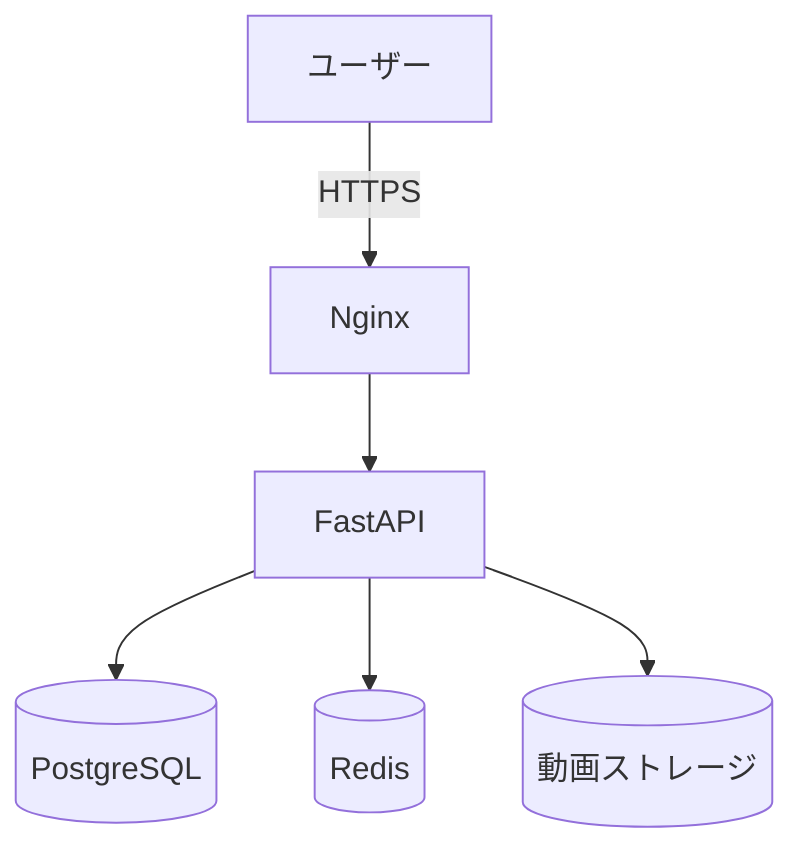
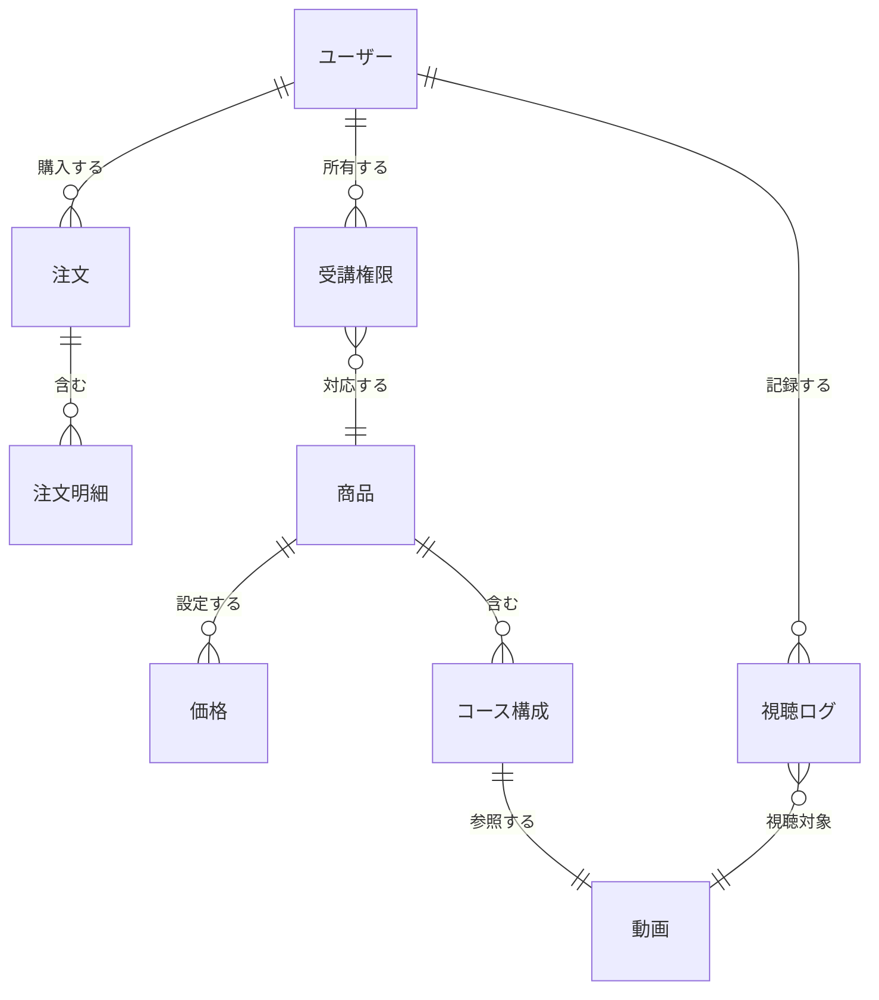

# 美容オンライン動画学習サイト 要件定義書

バージョン：1.0
作成日：2025/11/14

---

## 0. ドキュメント情報

| 項目      | 内容                        |
| ------- | ------------------------- |
| ドキュメント名 | 美容オンライン動画学習サイト 要件定義書      |
| バージョン   | 1.0                       |
| 作成日     | 2025/11/14                |
| 作成者     | ーーー                       |
| 承認者     | ーーー                       |
| 関連文書    | 基本設計書、詳細設計書、提案書、見積書、WBS 等 |

---

## 1. 背景・目的

### 1.1 背景

美容領域（メイク・スキンケア等）において、オンライン講座需要が高まっている一方、
既存プラットフォームは **高額講座の販売・講師ブランディング・体系的なコース提供** が不向きである。
本プロジェクトでは、講師のブランド価値を生かしながら **講座体系・講師紹介・動画販売・コース販売** に最適化した学習サイトを構築する。

### 1.2 目的

* 高額講座・動画の**オンライン販売基盤**を構築する
* **会員登録 → 決済 → 視聴権付与 → 動画視聴**まで一連のUXを提供
* 美容スクールにふさわしい **上質で信頼性のあるデザイン** を提供
* 将来的に講師数・講座数が増えても運用できるデータ構造を採用

---

## 2. スコープ

### 2.1 対象業務

| 区分     | 業務内容                          |
| ------ | ----------------------------- |
| 事務局    | 講座管理、講師管理、受講者ステータス管理、動画アップロード |
| 一般ユーザー | 会員登録、ログイン、動画購入、講座受講、プロフィール閲覧  |

### 2.2 対象外

| 区分        | 内容                      |
| --------- | ----------------------- |
| 集客業務      | SNS広告・LINE集客などは対象外（別業務） |
| 経理業務      | 会計処理・税計算などは行わない         |
| オフライン講義管理 | 対面講座管理は対象外              |

### 2.3 対象システム

* Webアプリ（スマホファースト）
* API（FastAPI）
* 管理画面（最低限）
* DB（PostgreSQL）
* 動画配信（ストリーミング前提／ダウンロード禁止）

---

## 3. 利用者要件

### 3.1 利用者区分

| 区分     | 説明            | 主な操作        |
| ------ | ------------- | ----------- |
| 一般ユーザー | 講座・動画を購入する受講者 | 会員登録、購入、視聴  |
| 講師     | 自身の講座の管理      | プロフィール、講座管理 |
| 管理者    | 事務局           | すべての管理作業    |

### 3.2 利用シナリオ

* 会員登録 → ログイン → 講座を閲覧 → 動画またはコースを購入 → 視聴権が付与される
* 無料体験動画 → 興味 → 講座購入
* 講師一覧 → 講師プロフィール確認 → コース選択

---

## 4. 機能要件

### 4.1 機能一覧

| ID   | 機能名           | 内容                  | 優先度 |
| ---- | ------------- | ------------------- | --- |
| F001 | 会員登録          | メール＋パスワード登録         | A   |
| F002 | ログイン          | JWT認証               | A   |
| F003 | 動画購入          | 単品またはコース販売          | A   |
| F004 | 決済機能          | クレジットカード決済（Square等） | A   |
| F005 | 視聴権限管理        | 購入済みユーザーのみ動画視聴可     | A   |
| F006 | 動画視聴          | ストリーミング再生（DL禁止）     | A   |
| F007 | 講座詳細          | 講座の内容・価格・講師表示       | A   |
| F008 | 講師プロフィール      | 講師紹介、価格表示、動画一覧      | A   |
| F009 | ホーム画面         | 講座一覧・魅力紹介・講師紹介      | A   |
| F010 | 問い合わせ（LINE誘導） | LINEリンク誘導           | B   |
| F011 | 管理画面          | 講座管理、動画管理、ユーザー状態確認  | B   |

---

## 5. 非機能要件

| 区分      | 要件                                 |
| ------- | ---------------------------------- |
| ストリーミング | HLS/MP4、右クリック禁止、DL禁止、スクショ防止（JSベース） |
| セキュリティ  | JWT、HTTPS、動画URL署名（期限付き）            |
| 性能      | 動画読み込み3秒以内（推奨）                     |
| 保守性     | データ構造を講座数増加に耐える設計                  |
| 運用性     | 管理画面で基本情報を更新可能                     |

---

## 6. システム構成要件

* **Web**：Nginx
* **App**：FastAPI (Python)
* **DB**：PostgreSQL
* **キャッシュ**：Redis
* **ストレージ**：Cloud Storage / S3
* **動画配信**：署名付きURL＋ストリーミング
* **構成図（Mermaid）**

---

## 7. 画面一覧（MVP版）

| 画面       | 目的               |
| -------- | ---------------- |
| ホーム（TOP） | 講座紹介・講師紹介・無料体験導線 |
| 講座一覧     | コースと動画の一覧表示      |
| 講座詳細     | 価格・内容・講師情報       |
| 講師一覧     | 講師写真と価格帯表示       |
| 講師プロフィール | プロフィール／経歴／講座一覧   |
| 会員登録     | メール＋PW登録         |
| ログイン     | JWTログイン          |
| マイページ    | 購入済み講座一覧／視聴開始    |
| 動画視聴ページ  | ストリーミング再生        |

---

## 8. データ要件（全量）

### 8.1 テーブル一覧

| テーブル         | 説明           |
| ------------ | ------------ |
| users        | 会員情報         |
| instructors  | 講師情報         |
| courses      | コース（複数動画で構成） |
| videos       | 単体動画         |
| course_items | コース内の動画構成    |
| products     | 販売商品（動画・コース） |
| price        | 価格           |
| orders       | 注文           |
| order_items  | 注文明細         |
| entitlements | 視聴権限         |
| playback_log | 視聴ログ         |

### 8.2 関係図（Mermaid／日本語）

---

## 9. 運用要件

* 毎日バックアップ
* 動画URLは7日で失効
* 操作ログ90日保持
* 管理者は講座の公開/非公開を切替可能

---

## 10. 制約・リスク

| リスク           | 内容           | 対策             |
| ------------- | ------------ | -------------- |
| 動画の不正ダウンロード   | 録画・キャプチャされうる | 透かし・JS検知・DRM検討 |
| 高額商材のため返金トラブル | 決済後のサポートが重要  | 返金規約を明記        |
| サーバ負荷         | 動画配信で高負荷     | CDN導入余地を確保     |

